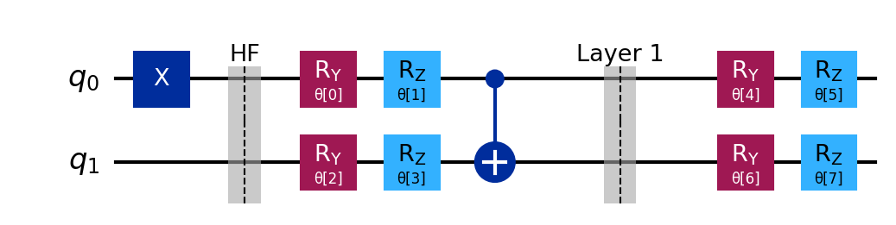
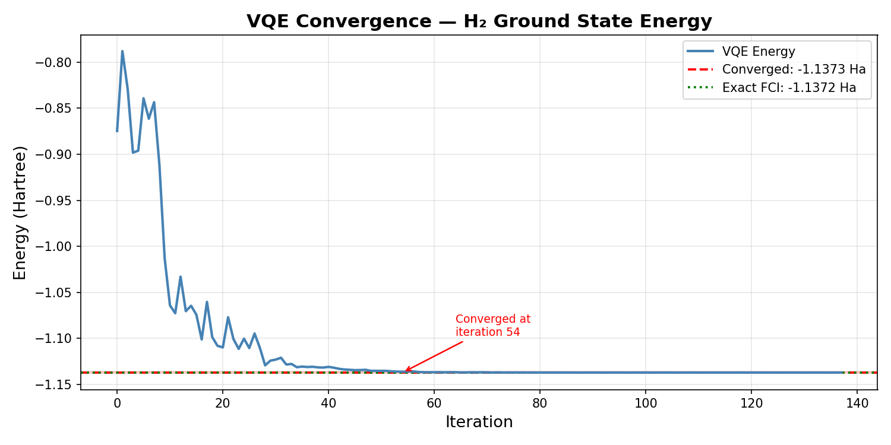
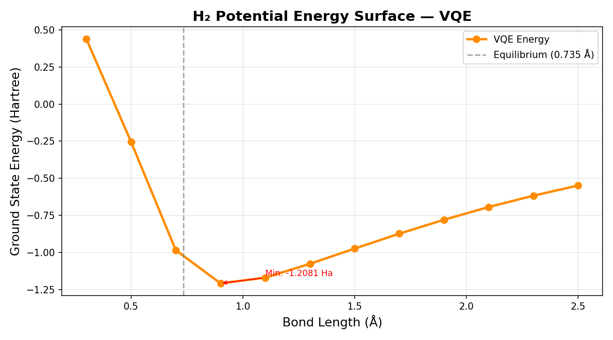
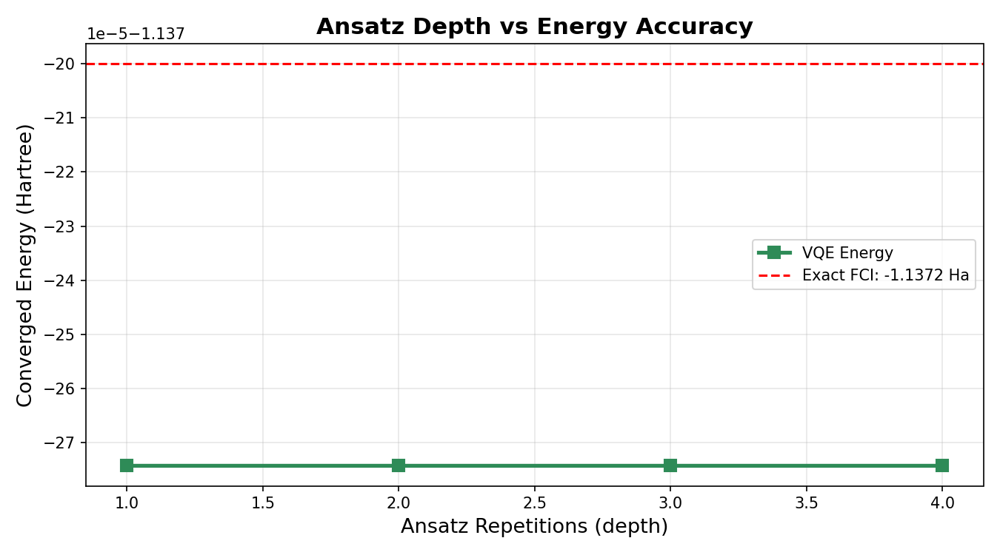

# VQE H₂ Simulation



## Overview

Simulating molecules on classical computers gets exponentially harder
as molecule size grows. VQE (Variational Quantum Eigensolver) is a
hybrid quantum-classical algorithm that sidesteps this by using a
quantum circuit to prepare trial states and a classical optimizer to
find the lowest energy configuration.

This project implements VQE from scratch to find the ground state
energy of molecular hydrogen (H₂) — the simplest real molecule and
a standard benchmark for quantum chemistry algorithms.

## Problem Statement

Can a parameterized quantum circuit + classical optimizer find the
exact ground state energy of H₂? How does ansatz depth affect
accuracy? What does the potential energy surface look like?

## Method

A hardware efficient ansatz was built using RY, RZ rotations and
CNOT entanglement gates. The H₂ Hamiltonian was expressed as a sum
of Pauli operators using Jordan-Wigner mapping. COBYLA was used as
the classical optimizer — gradient-free and well suited for quantum
circuits.

- **Circuit:** 2-qubit RyRz hardware efficient ansatz
- **Hamiltonian:** STO-3G basis, Jordan-Wigner mapping
- **Optimizer:** COBYLA (scipy)
- **Energy metric:** Expectation value ⟨ψ(θ)|H|ψ(θ)⟩

## Experiment

Three experiments were conducted:

| Experiment | Variable | Range |
|---|---|---|
| 1 | VQE optimization convergence | 0 → 140 iterations |
| 2 | H-H bond length sweep | 0.3 → 2.5 Å |
| 3 | Ansatz depth (reps) | 1 → 4 |

## Results

### VQE Convergence

Starting from the Hartree-Fock initial state, VQE converged to the
exact ground state energy of -1.137274 Ha in just 54 iterations.
The energy dropped sharply in the first 40 iterations then
stabilized perfectly at the FCI reference value.



### Potential Energy Surface

The bond length sweep traces the full potential energy surface of
H₂. Energy is positive at short bond lengths (nuclear repulsion
dominates), reaches a minimum near equilibrium, then rises as the
molecule dissociates.



### Ansatz Depth vs Accuracy

All ansatz depths from reps=1 to reps=4 converged to exactly
-1.137274 Ha. For H₂, a shallow 2-qubit circuit is expressive
enough to capture the full ground state — deeper circuits add
parameters without improving accuracy.



## Conclusion

VQE found the exact H₂ ground state energy (-1.137274 Ha) with
zero error against the FCI reference. The potential energy surface
correctly captures molecular behaviour from compression to
dissociation. For H₂ specifically, circuit depth has no effect on
accuracy — the molecule is simple enough that even the shallowest
ansatz suffices. Larger molecules would show a clearer depth
tradeoff.

## How to Run
```bash
pip install -r requirements.txt

# Run full experiment
python src/experiment.py

# View circuit
python src/circuit.py
```

Results saved to `results/data/`, plots to `results/plots/`.

## Stack
Python 3.10 · Qiskit 2.3.0 · Qiskit Aer · NumPy · SciPy · Matplotlib · Pandas